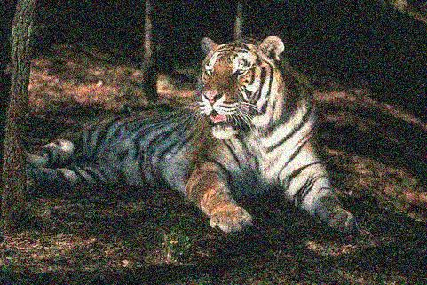
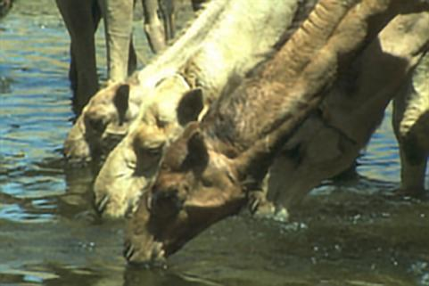

# EPLL PyTorch Implementation

This repository contains an implementation of [EPLL](https://people.csail.mit.edu/danielzoran/EPLLICCVCameraReady.pdf) 
and the implementation for the work [Posterior Sampling for Image Restoration using Explicit Patch Priors](https://arxiv.org/abs/2104.09895) in PyTorch.

# Expected Patch Log-Likelihood
[Expected Patch Log-Likelihood (EPLL)](https://people.csail.mit.edu/danielzoran/EPLLICCVCameraReady.pdf) is a well established image decorruption 
algorithm. EPLL uses a _patch_-denoiser in order to restore _full images_, using the Half-Quadratic Splitting algorithm. The original paper uses a 
Gaussian mixture model (GMM) in order to denoise patches, but in principal any patch-denoiser can be used. This implementation allows for _any_ patch
denoiser to be used in order to restore images.

## Denoising 
```denoise_demo.py``` shows how to denoise an image using the EPLL algorithm. Running it should produce the 
following images:

 

The first image is the noisy version and the second one is the denoised version, specifically under noise with $\sigma=35/255$.
The patch-prior for these results is a GMM with 100 centers trained on ~5 million patches from the 
[BSD300](https://www2.eecs.berkeley.edu/Research/Projects/CS/vision/bsds/) train set.

This implementation follows the terminology of [Posterior Sampling for Image Restoration using Explicit Patch Priors](https://arxiv.org/abs/2104.09895), 
which interprets the EPLL-loss as a loss of grids of the image. This allows for easily running faster versions of the same
EPLL algorithm (using less grids), albeit at a slight cost of accuracy. For instance, the above images were produced using
16 grids, which takes ~5.2 seconds (with a GPU), while running on the same task with 4 grids takes ~1.3 seconds.


## General Corruptions
EPLL is widely known not for denoising, but for general image restorations. This implementation allows for that as well!

```deblur_demo.py``` shows how to deblur an image using this implementations and should produce the following images:

 

Crucially, this implementation uses automatic differentiation in order to decorrupt images. _Any_ corruption process $H$ can be restored, as long
as $H$ is passed as a differentiable function to the function ```EPLL.decorrupt```.

## Changing the Patch-Prior
While a GMM is commonly used for EPLL, essentially any other patch-prior can be used. Specifically, all that is needed is a class with a function 
```denoise``` which receives batches of patches as well as the noise variance and returns the denoised patches.
